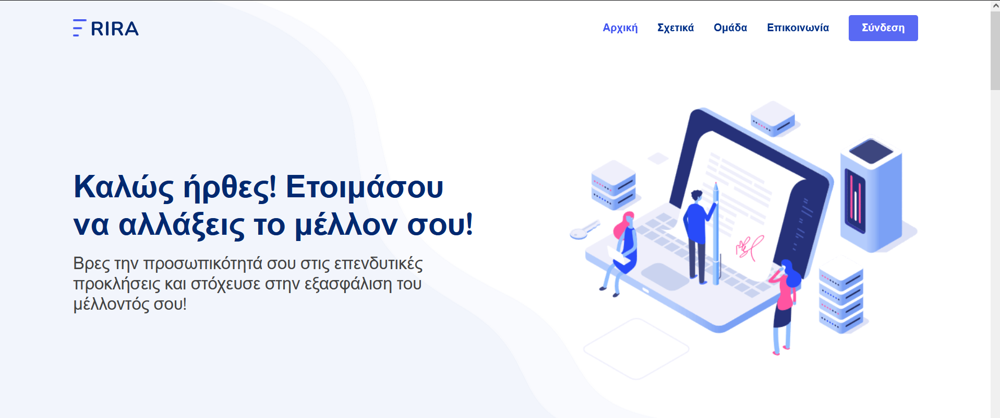
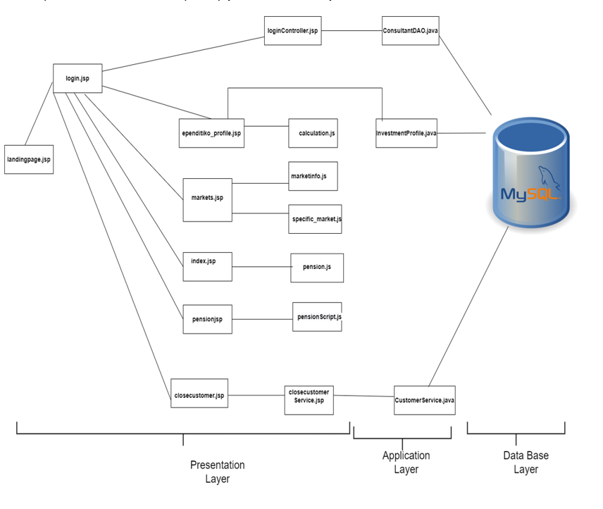
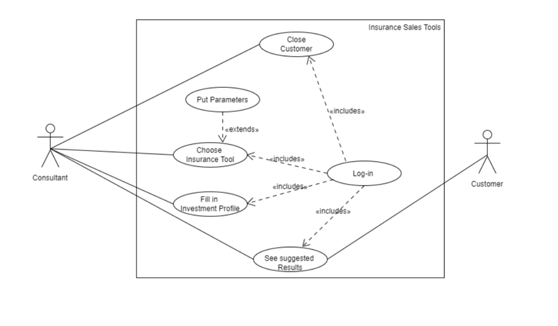
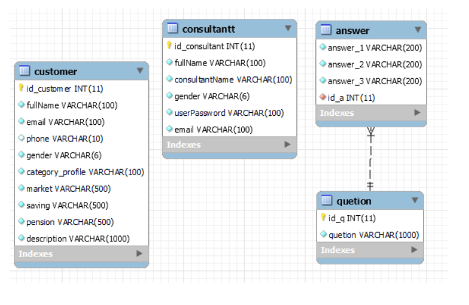
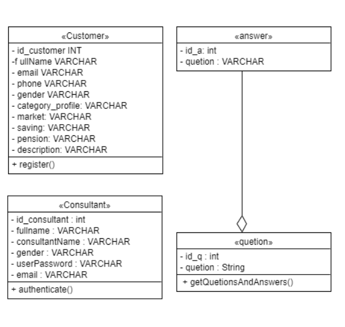

__RIRA__

A web - app with Useful insurance tools!

About 

RIRA is a web app that helps consultants to close new customers. Specifically, the app contains three useful insurance tools that consultant use them so as to the end of showing off , they manage to close the customer.

This app based on 3-tier architect. 
Here, are the diagrams for our app. 

* component diagram 

* use case diagram 

* data base diagram diagram 

* class diagram

